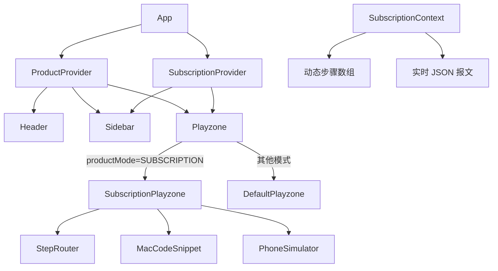
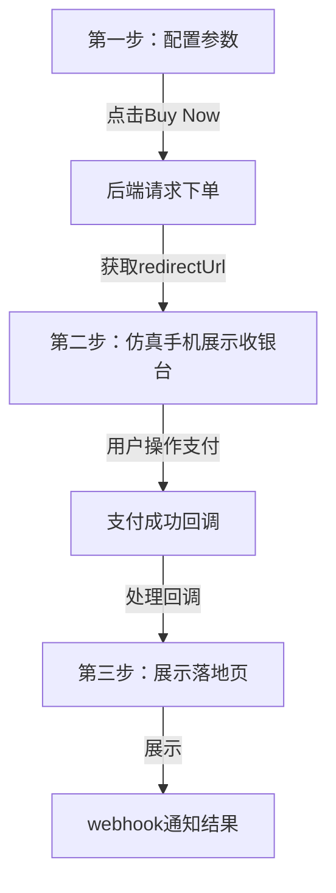

# PayerMax Interactive Hub — V2 技术文档

> 文档版本：V2.0.0  
> 生成时间：2026-04-16  
> 项目路径：`C:\XM\PMX_Demo\payermax-payment-demo`

---

## 概述

PayerMax Interactive Hub 是一个面向开发者的**订阅代扣场景沙盘演示系统**。系统通过实时生成 API 报文、模拟手机端用户交互，让接入方直观理解 PayerMax 的订阅代扣接入全流程。

---

## 技术栈

| 层级 | 技术选型 |
|---|---|
| 前端框架 | React 18 + TypeScript + Vite |
| 样式引擎 | Tailwind CSS v3 |
| 状态管理 | React Context API（双 Context 分层） |
| 图标库 | Lucide React |
| 后端 | Node.js + Express（BFF 层，Mock 模式）|
| 包管理 | npm |

---

## 目录结构

```
payermax-payment-demo/
├── frontend/
│   └── src/
│       ├── App.tsx                          # 根节点：注入双 Provider
│       ├── types/
│       │   └── subscription.ts              # 订阅业务全量类型定义
│       ├── config/
│       │   ├── subscriptionSteps.ts         # 步骤动态计算（含前置组件分支）
│       │   └── payloadTemplates.ts          # 各步骤 JSON 报文生成器
│       ├── contexts/
│       │   ├── ProductContext.tsx           # 全局业务线上下文
│       │   └── SubscriptionContext.tsx      # 订阅代扣专属上下文
│       └── components/
│           ├── layout/
│           │   ├── Header.tsx               # 顶栏：Logo + 业务线切换 Tabs
│           │   ├── Sidebar.tsx              # 左侧配置面板（自适应模式）
│           │   └── Playzone.tsx             # 主沙盘区（三栏布局）
│           ├── shared/
│           │   ├── MacCodeSnippet.tsx       # Mac 风格代码块 + Execute 按钮
│           │   ├── DynamicStepper.tsx       # 极简步进导航条
│           │   └── PhoneSimulator.tsx       # 仿真手机壳组件
│           └── features/
│               └── subscription/
│                   ├── StepRouter.tsx       # 步骤路由代理（ID → 组件）
│                   ├── StepConfig.tsx       # Step 1: 参数配置
│                   ├── StepCreatePlan.tsx   # Step 2: 创建订阅计划（PayerMax）
│                   ├── StepActivate.tsx     # Step 3: 激活订阅（cashier/api）
│                   ├── StepComponent.tsx    # Step N: 加载前置组件（通用）
│                   ├── StepBind.tsx         # Step 2: 首次绑定（Merchant/NP）
│                   ├── StepDeduct.tsx       # Step 3: 后续代扣
│                   └── StepComplete.tsx     # 最终完成 + Webhook
└── backend/                                 # Node.js BFF（预留）
```

---

## 业务能力矩阵

### 业务模式（SubMode）

| 值 | 中文名 | 步骤数（标准/前置组件）|
|---|---|---|
| `payermax` | PayerMax 托管（周期性订阅）| 4 步 / 4 步（组件替换激活步）|
| `merchant` | 商户自管（周期性订阅）| 3 步 / 3 步（组件替换绑定步）|
| `nonperiodic` | 非周期性代扣 | 3 步 / 3 步 |

### 集成方式（IntegrationMode）

| 值 | API 参数 | 说明 |
|---|---|---|
| `cashier` | `integrate: Hosted_Checkout` | 跳转 PayerMax 收银台 |
| `api` | `integrate: Direct_Payment` | 后端直接调用 API |
| `component` | `applyDropinSession` | 前端加载前置组件（PayerMax 模式增 1 步）|

### 支付方式（PaymentMethod）

| 值 | apiType | 限制 |
|---|---|---|
| `card` | `CARD` | 无 |
| `applepay` | `APPLEPAY` | 无 |
| `googlepay` | `GOOGLEPAY` | 无 |
| `apm` | `ONE_TOUCH` | ⚠️ 不支持前置组件集成方式 |

### 订阅类型（SubscriptionType，仅 PayerMax 模式）

| 值 | 说明 | 激活金额逻辑 |
|---|---|---|
| `standard` | 普通订阅 | 等于每期金额 |
| `trial` | N 天免费试用 | 固定为 0 |
| `discount` | 前 N 期优惠价 | 等于每期金额 |
| `trial_discount` | 试用 + 优惠组合 | 等于试用期设定金额 |

---

## Context 架构说明



### SubscriptionContext 暴露的核心状态

| 属性 / 方法 | 类型 | 说明 |
|---|---|---|
| `subMode` | `SubMode` | 当前业务模式 |
| `integrationMode` | `IntegrationMode` | 当前集成方式 |
| `paymentMethod` | `PaymentMethod` | 当前支付方式 |
| `subscriptionType` | `SubscriptionType` | 当前订阅类型 |
| `formParams` | `SubscriptionFormParams` | 全量表单参数 |
| `steps` | `StepConfig[]` | 动态计算的步骤数组（useMemo）|
| `payloadCode` | `string` | 当前步骤的 JSON 报文（useMemo）|
| `currentStep` | `StepConfig` | 当前步骤 |
| `goNext / goPrev` | `() => void` | 步骤流转 |
| `updateFormParam` | `(key, value) => void` | 参数实时更新 |

---

## 步骤 ID → 组件 路由表

```
pm-1          → StepConfig
pm-2          → StepCreatePlan
pm-activate   → StepActivate
pm-component  → StepComponent
pm-complete   → StepComplete
m-1           → StepConfig
m-bind        → StepBind
m-component   → StepComponent
m-deduct      → StepDeduct
np-1          → StepConfig
np-bind       → StepBind
np-component  → StepComponent
np-deduct     → StepDeduct
```

---

## 兼容性规则

```typescript
// APM 与前置组件互斥（src/types/subscription.ts）
export function isCompatible(payment: PaymentMethod, integration: IntegrationMode): boolean {
  return !(payment === 'apm' && integration === 'component');
}
```

触发时机：
- 切换集成方式时检查当前支付方式
- 切换支付方式时检查当前集成方式
- 任一不满足时：弹提示 → 自动重置集成方式为 `cashier`

---

## 本地运行

```bash
# 前端
cd frontend
npm install
npm run dev        # http://localhost:5173

# 后端（可选，Mock 模式下前端可独立运行）
cd backend
npm install
npm run dev        # http://localhost:3000
```

---

## 后续开发指引

### 添加新步骤

1. 在 `src/config/subscriptionSteps.ts` 的对应模式分支中新增 `StepConfig` 对象
2. 在 `src/config/payloadTemplates.ts` 的 `getPayloadForStep()` 中新增对应 `stepId` 分支
3. 新建 `src/components/features/subscription/StepXxx.tsx` 步骤组件
4. 在 `StepRouter.tsx` 的 `STEP_MAP` 中注册路由

### 添加新业务模式

1. 在 `src/types/subscription.ts` 中扩展 `SubMode` union type 和 `SUB_MODE_CONFIG`
2. 在 `src/config/subscriptionSteps.ts` 中新增 `if (subMode === 'xxx')` 分支
3. 在 `src/config/payloadTemplates.ts` 中新增对应步骤报文逻辑
4. 在 `SubscriptionContext` 中无需修改（自动响应新 SubMode）
5. Sidebar 的 `SubscriptionSidebar` 无需修改（自动读取 `SUB_MODE_CONFIG` 渲染）

> [!TIP]
> **架构红线**：禁止在 `App.tsx` 或 `Playzone.tsx` 编写业务逻辑。所有新增功能必须遵循：`types 定义` → `config 计算` → `Context 存储` → `组件消费` 的单向开发流。

---

## 变更历史

| 版本 | 日期 | 主要内容 |
|---|---|---|
| V1.0 | 2026-04-15 | 初始架构（单 Context + 3 步静态流）|
| V1.5 | 2026-04-15 | Pipeline 通栏化 + 步进仪重构 + 按钮内聚 |
| V2.0 | 2026-04-16 | 订阅业务流全量迁移 + 三栏布局 + 手机分步内容 |
| V2.1 | 2026-04-20 | 标准收单全量收银台模式流程优化 |

---

## 标准收单全量收银台模式流程设计

### 整体流程



### 详细流程

#### 步骤1：配置参数
- 用户在左侧配置面板设置支付参数
- 点击Buy Now按钮发起后端API调用
- 后端返回redirectUrl和tradeToken

#### 步骤2：仿真手机展示收银台
- 仿真手机加载redirectUrl展示收银台页面
- 用户在仿真手机上完成支付操作
- 支付成功后，PayerMax会回调前端设置的frontCallbackUrl

#### 步骤3：支付成功处理与跳转
- **回调处理**：前端App.tsx监听URL参数变化
- **状态保持**：使用React状态管理保存当前步骤和订单信息
- **自动跳转**：检测到支付成功回调后，自动跳转到第三步

#### 步骤4：第三步展示
- 展示支付成功落地页
- 代码块展示webhook通知结果
- 显示订单详情和支付状态

### 技术实现

#### 前端回调处理

在App.tsx中添加URL参数监听：

```typescript
// App.tsx 中添加
useEffect(() => {
  // 监听URL参数变化，处理支付回调
  const handleCallback = () => {
    const urlParams = new URLSearchParams(window.location.search);
    const payStatus = urlParams.get('payStatus');
    const outTradeNo = urlParams.get('outTradeNo');
    const tradeToken = urlParams.get('tradeToken');
    
    // 只有在标准收单模式且当前在第二步时处理回调
    if (productMode === 'STANDARD' && currentStep === 's2' && payStatus === 'SUCCESS' && outTradeNo) {
      // 支付成功，跳转到第三步
      setCurrentStep('s3');
      
      // 更新API响应数据
      setLastApiResponse({
        code: 'SUCCESS',
        msg: '支付成功',
        data: {
          outTradeNo,
          tradeToken,
          payStatus,
          redirectUrl: window.location.href
        }
      });
      
      // 清除URL参数，避免重复处理
      window.history.replaceState({}, document.title, window.location.pathname);
    }
  };

  // 初始化时检查
  handleCallback();
  
  // 监听popstate事件
  window.addEventListener('popstate', handleCallback);
  return () => window.removeEventListener('popstate', handleCallback);
}, [productMode, currentStep, setCurrentStep, setLastApiResponse]);
```

#### 第三步内容设计

在ProductContext.tsx中添加第三步的mockApiData逻辑：

```typescript
// ProductContext.tsx 中添加
if (currentStep === 's3') {
  const orderNo = lastApiResponse?.data?.outTradeNo || randomOrder;
  return {
    endpoint: { method: 'POST', url: '/api/webhook' },
    requestBody: JSON.stringify({
      version: "1.5",
      keyVersion: "1",
      requestTime: futureTime,
      appId: "67eff2f3b29a4ecf9576321185dbf658",
      merchantNo: "SDP01010114048893",
      orderNo: orderNo,
      payStatus: "SUCCESS",
      amount: "11.00",
      currency: "USD",
      signature: "..."
    }, null, 2),
    responseBody: JSON.stringify({
      code: "SUCCESS",
      msg: "Webhook通知处理成功",
      data: {
        orderNo: orderNo,
        payStatus: "SUCCESS",
        amount: "11.00",
        currency: "USD",
        notifyTime: new Date().toISOString()
      }
    }, null, 2)
  };
}
```

#### 后端webhook接口

在server.js中实现webhook接口：

```javascript
// server.js 中添加
app.post('/api/webhook', async (req, res) => {
  try {
    const notifyData = req.body;
    logger.info('📥 WebHook 通知数据：', JSON.stringify(notifyData));

    // 1. RSA 验签：验证通知数据的真实性（核心安全校验）
    const isSignValid = verifySign(notifyData);
    if (!isSignValid) {
      logger.error('❌ WebHook 验签失败，数据可能被篡改');
      return res.status(403).send('FAIL'); // 验签失败返回FAIL，PayerMax会重试
    }

    // 2. 防重处理：检查该通知是否已处理过
    const orders = getOrders();
    const existingOrder = orders.find(order => order.orderNo === notifyData.orderNo);
    if (existingOrder && existingOrder.notifyProcessed) {
      logger.warn(`⚠️ 该通知已处理，orderNo：${notifyData.orderNo}`);
      return res.send('SUCCESS'); // 已处理直接返回SUCCESS
    }

    // 3. 数据校验：核对订单金额、状态等信息
    if (existingOrder && Number(existingOrder.amount) !== Number(notifyData.amount)) {
      logger.error(`❌ 订单金额不匹配，orderNo：${notifyData.orderNo}`);
      return res.status(400).send('FAIL');
    }

    // 4. 更新订单状态
    if (existingOrder) {
      existingOrder.payStatus = notifyData.payStatus;
      existingOrder.notifyProcessed = true;
      existingOrder.notifyTime = new Date().toLocaleString();
      existingOrder.notifyData = notifyData;
      saveOrders(orders);
      logger.info(`✅ 订单状态更新成功，orderNo：${notifyData.orderNo}，新状态：${notifyData.payStatus}`);
    } else {
      // 处理未找到的订单（可能是前端支付未同步到本地，临时创建订单记录）
      orders.push({
        orderNo: notifyData.orderNo,
        amount: Number(notifyData.amount),
        payStatus: notifyData.payStatus,
        createTime: new Date().toLocaleString(),
        notifyProcessed: true,
        notifyTime: new Date().toLocaleString(),
        notifyData: notifyData
      });
      saveOrders(orders);
      logger.info(`✅ 新增订单记录（WebHook触发），orderNo：${notifyData.orderNo}`);
    }

    // 5. 按PayerMax要求，必须返回SUCCESS字符串（大小写敏感）
    res.send('SUCCESS');
  } catch (err) {
    logger.error('❌ WebHook 处理异常：', err);
    // 异常时返回FAIL，PayerMax会重试通知
    res.status(500).send('FAIL');
  }
});
```

### 预期效果

1. **第一步**：用户配置参数，点击Buy Now发起下单请求
2. **第二步**：仿真手机展示收银台页面，用户操作支付
3. **支付成功**：自动跳转到第三步，不再刷新回到第一步
4. **第三步**：展示支付成功落地页，代码块展示webhook通知结果

### 测试验证

1. 测试标准收单全量收银台模式的完整流程
2. 验证支付成功后是否正确跳转到第三步
3. 检查第三步是否正确展示webhook通知结果
4. 测试页面刷新后状态是否保持
